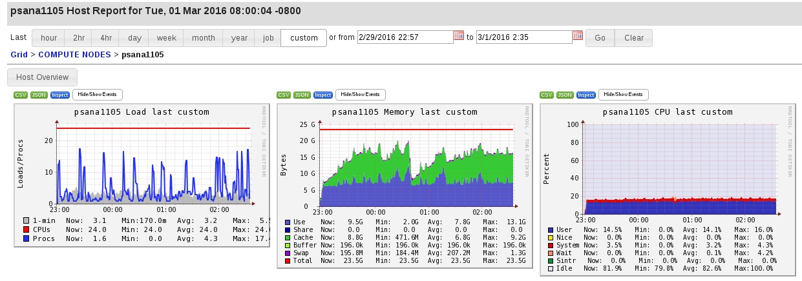

# xtcav-mlearn-doc

this is xtcav-mlearn-doc

## Here are results from Mar 1 2016

The data for the peak classification:

```
0 no t0, t1 or t2
1   t0 > 5, but no t1 or t2
2   t0 and t1 > 7 but no t2 
3   t0 and t1 > 7 and t2 > 7
```

* acq channels are normalized to median(abs(waveform))==1
* linear voltage correction applied to channels 8 and 11
* peaks found by thresholding in expected region for t0,t1,t2 based on l3
* for there to be both a t1 and t2, they must be within I think 40% of one another
(to filter out little peaks on the climbing waveform up to one of the peaks)

### Trying to get a sense of how much memory/time it takes to run the network

```
mini vld k1ch k1dim k2ch k2dim h3u   pp  train   eval mem(MB) #vars  H_W
-----------------------------------------------
   1   1    1     2    1     2  10  log    0.1    0.1   109.39    544  48,10   10,4
   1   1    1     2    1     2  10 none    0.1    0.1   118.70    544  48,10   10,4
  10  10    1     2    1     2  10 none    0.6    0.4   355.58    544  48,10   10,4
  10  10    1     2    1     2  10  log    0.6    0.5   325.29    544  48,10   10,4
  10  10    1     2    1     2  10  log    0.6    0.5   353.30    544  48,10   10,4
  10  10    2     2    1     2  10  log    0.7    0.5   545.66    553  48,10   10,4
  10  10    1     2    2     2  10  log    0.7    0.5   332.88   1029  96,10   10,4
  10  10    2     2    2     2  10  log    0.7    0.6   446.98   1042  96,10   10,4
  10  10    2     4    2     2  10  log    1.1    0.6   828.64   1066  96,10   10,4
  10  10    2     2    2     4  10  log    0.7    0.5   445.77   1090  96,10   10,4
  10  10    2     4    2     4  10  log    1.1    0.7   974.42   1114  96,10   10,4
  10  10    2     4    2     4 100  log    1.1    0.6   863.39  10204  96,100  100,4
 128 400    2     4    2     4 100  log   13.1   40.5 18535.74  10204  96,100  100,4
 128 400    8     8    8     6 100  log   13.1   40.5 18535.74  41736 384,100  100,4
  32  64    8     8    8     6  10  log   12.4    5.2 15071.65   6726 384,10   10,4

```
### classification run

* Here are results of that last run, minibatch 32, validation 64,
* 8 channels for first convolution, with 8x8 kernel
* then there is a maxpool window=13,strides=10)

```
network/lsf report
('CVN01', 'CVN02')
('H03', 'H04')
evolving learning rate
whitenedInput.shape=(32, 726, 568, 1)  50.34 MB
CVN01:
             CVN_K.shape=(8, 8, 1, 8)
          CVN_conv.shape=(32, 726, 568, 8)   402.70 MB
             CVN_B.shape=(8,)
     CVN_nonlinear.shape=(32, 726, 568, 8)   402.70 MB
         CVN_pool.shape=(32, 73, 57, 8)  4.06 MB
             CVN_U.shape=(32, 73, 57, 8)  4.06 MB
CVN02:
             CVN_K.shape=(6, 6, 8, 8)
          CVN_conv.shape=(32, 73, 57, 8)   4.06 MB
             CVN_B.shape=(8,)
     CVN_nonlinear.shape=(32, 73, 57, 8)   4.06 MB
         CVN_pool.shape=(32, 8, 6, 8)  0.05 MB
             CVN_U.shape=(32, 8, 6, 8)  0.05 MB
H03:
   H_W.shape=(384,10)
   H_B.shape=(10,)
   H_U.shape=(32,10)  0.00 MB
H04:
   H_W.shape=(10,4)
   H_B.shape=(4,)
   H_U.shape=(32,4)  0.00 MB
convnet has 6726 unknown variables, 2832 (42%) in convnet layers, and 3894 (57%) in hidden layers.
convnet maps 412368 features to 4 outputs for hidden layers.
total memory: 1274.76 MB
initial loss=1.39
  step m1s  tr.acc/#1s tst.acc/#1s xentropy  loss  |grad| gr-ang  learnrate 
     1   9   0.25   1   0.28   1   1.3859   1.3859 -1.000   0.00   0.0100
    51   9   0.22   0   0.25   0   1.3896   1.3896 -1.000   0.00   0.0096
   101   7   0.25   0   0.25   0   1.3867   1.3867 -1.000   0.00   0.0092
   151   8   0.25  32   0.16  64   1.3858   1.3858 -1.000   0.00   0.0088
   201   6   0.19  32   0.16  64   1.3880   1.3880 -1.000   0.00   0.0085
   251   7   0.22  32   0.16  64   1.3903   1.3903 -1.000   0.00   0.0082
   301   6   0.19  32   0.16  64   1.3890   1.3890 -1.000   0.00   0.0078
   351   8   0.28   0   0.27   0   1.3856   1.3856 -1.000   0.00   0.0075
   401   9   0.41  10   0.25  14   1.3847   1.3847 -1.000   0.00   0.0072
   451  11   0.12   0   0.30   0   1.3888   1.3888 -1.000   0.00   0.0069
   501  12   0.41  31   0.17  63   1.3780   1.3780 -1.000   0.00   0.0066
   551   5   0.16  32   0.16  64   1.3891   1.3891 -1.000   0.00   0.0064
   601  12   0.19   0   0.34   0   1.3996   1.3996 -1.000   0.00   0.0061
   651   5   0.47  11   0.41  26   1.3262   1.3262 -1.000   0.00   0.0059
   701   5   0.44   9   0.39  20   1.3207   1.3207 -1.000   0.00   0.0056
   751   3   0.56   0   0.52   0   1.1173   1.1173 -1.000   0.00   0.0054
   801   9   0.34   6   0.44  11   1.2302   1.2302 -1.000   0.00   0.0052
   851   5   0.44   8   0.47  23   1.2748   1.2748 -1.000   0.00   0.0050
   901   8   0.59   7   0.52  23   1.1186   1.1186 -1.000   0.00   0.0048
   951   8   0.56   3   0.64   6   0.9401   0.9401 -1.000   0.00   0.0046
training steps average     12.407 sec/step. 1001 steps in 12419.30 secs
minibatch reading average  0.531 sec/step. 1000 steps in 530.72 secs
eval average               5.165 sec/step. 20 steps in 103.31 secs
total time in file I/O, train, eval: 13053.32 sec
	Command being timed: "python convnet_app.py -c convnet_flags_pks.py --threads 24 --learning .01,.96,50 --regularization 0.00001 --optimizer mom --momentum 0.85 --steps 1000 --evals 50 --validationset 64 --minibatch 32 --numbatches 200 --k1ch 8 --k1strd 1,1 --k1dim 8 --pool1 13,10 --k2ch 8 --k2strd 1,1 --k2dim 6 --pool2 13,10 --h3u 10 --kstd 0.03 --wstd 0.03 --bias 1:0.0,2:0.0,3:0.0,4:0.0 --preprocess log"
	User time (seconds): 46941.26
	System time (seconds): 10627.54
	Percent of CPU this job got: 440%
	Elapsed (wall clock) time (h:mm:ss or m:ss): 3:37:49
	Average shared text size (kbytes): 0
	Average unshared data size (kbytes): 0
	Average stack size (kbytes): 0
	Average total size (kbytes): 0
	Maximum resident set size (kbytes): 15433368
	Average resident set size (kbytes): 0
	Major (requiring I/O) page faults: 19977
	Minor (reclaiming a frame) page faults: 948453338
	Voluntary context switches: 1686094434
	Involuntary context switches: 20237266
	Swaps: 0
	File system inputs: 1535912
	File system outputs: 184
	Socket messages sent: 0
	Socket messages received: 0
	Signals delivered: 0
	Page size (bytes): 4096
	Exit status: 0

------------------------------------------------------------
Sender: LSF System <lsf@psana1105.pcdsn>
Subject: Job 360760: <python gather_convnet_app_stat.py> in cluster <slac> Done

Job <python gather_convnet_app_stat.py> was submitted from host <psana1612.pcdsn> by user <davidsch> in cluster <slac>.
Job was executed on host(s) <psana1105.pcdsn>, in queue <psanaq>, as user <davidsch> in cluster <slac>.
</reg/neh/home/davidsch> was used as the home directory.
</reg/neh/home/davidsch/condaDev/xtcav-mlearn/convnet> was used as the working directory.
Started at Mon Feb 29 22:59:03 2016
Results reported on Tue Mar  1 02:36:55 2016

Your job looked like:

------------------------------------------------------------
# LSBATCH: User input
python gather_convnet_app_stat.py
------------------------------------------------------------

Successfully completed.

Resource usage summary:

    CPU time :                                   68248.66 sec.
    Max Memory :                                 21089 MB
    Average Memory :                             11968.19 MB
    Total Requested Memory :                     -
    Delta Memory :                               -
    Max Swap :                                   603 MB
    Max Processes :                              5
    Max Threads :                                54
    Run time :                                   13072 sec.
    Turnaround time :                            13080 sec.

The output (if any) is above this job summary.
```
### Ganglia plot

